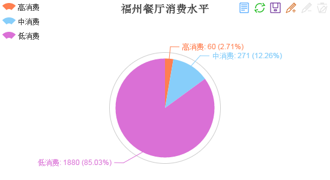
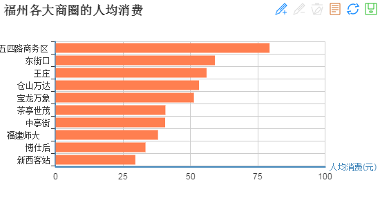

作为一个伪吃货（很想吃但有很多忌口，同时又吃不胖），怀着为福州吃货服务的理想，我决定：我来爬爬餐厅。

# 源代码

Talk is cheap, show me the code. 依照惯例，先贴代码。
[https://github.com/SmileXie/dianping_crawler](https://github.com/SmileXie/dianping_crawler)
用python3来收集数据，用MySQL来保存、分析数据。编码中用到了几个Python库：Requests, Beautifulsoup, MySQL Python connector. 数据库用到了MySQL。

# 数据样本

数据样本来源于大家熟知的“大众点评”，收集了其中7740家福州餐厅的数据。
其中，包含以下特征之一的数据，我认为是无效的数据，予以剔除:
* 点评星级为0
* 人均消费大于3000

# 统计分析

每个统计结果之前，我都会把对应的SQL查询语句附上，供较真儿的程序员们分析。

## 福州最贵餐厅TOP20

把所有餐厅按人均消费排序：
``` sql
mysql> select id, name, branch_name, price, category, district from ResTable order by price desc limit 20;
```

|餐厅名                           | 分店名                | 人均消费 | 分类            | 商圈            |
|---------------------------------|-----------------------|-------|---------------------|---------------------|
|和怀石料理                       |                       |   505 | 日本料理            | 左海/西湖公园       |
|一德鲍鱼私房菜                   |                       |   489 | 私房菜              | 五四路商务区        |
|安野牧场烧肉专门店               | 二环店                |   459 | 烧烤                | 西禅寺              |
|荀怀石料理                       |                       |   419 | 日本料理            | 五一广场            |
|海天盛宴海鲜自助                 |                       |   415 | 自助餐              | 五一广场            |
|聚春园大酒店                     | 东街口总店            |   411 | 福州菜/家常菜       | 东街口              |
|雍和会海鲜姿造                   | 湖东店                |   410 | 海鲜                | 五四路商务区        |
|凯宾斯基酒店·云阁扒房            |                       |   405 | 西餐                | 东二环泰禾          |
|澜悦海鲜自助餐厅                 |                       |   389 | 海鲜                | 五一广场            |
|松月自慢料理                     |                       |   376 | 日本料理            | 五四路商务区        |
|王品牛排                         | 福州大洋晶典店        |   368 | 西式正餐            | 东街口              |
|安野牧场烧肉专门店               | 信和店                |   368 | 烧烤                | 五四路商务区        |
|隐家·锅物专门                    |                       |   365 | 日本料理            | 东街口              |
|王品牛排                         | 福州泰禾店            |   365 | 西式正餐            | 东二环泰禾          |
|国惠大酒店                       | 吴航店                |   360 | 福州菜/家常菜       | 长山湖              |
|山水大酒店                       |                       |   358 | 其他中餐            | 东街口              |
|七号院                           |                       |   330 | 快餐简餐            | 左海/西湖公园       |
|升隆会海鲜旖旎                   |                       |   328 | 海鲜                | 台江万达            |
|欧斯克生蚝吧                     | 万科广场              |   303 | 其他西餐            | 宝龙万象            |
|罗源湾世纪金源大饭店             | 餐饮部                |   300 | 自助餐              | 罗源县其他          |

“福州最贵餐厅”称号被“和怀石料理”收入囊中，人均消费505元让我等屌丝望而确步。人均消费400+的餐厅有八家。
TOP20中，日本料理分类占得最多。左海/西湖公园、五四路商业区、五一广场是TOP20高端消费餐厅较为聚集的商圈。
比较尴尬的一点是。大众点评的app中已经有了比较完善的排序功能。在app中已经可以方便地按价格排序得到以上的结果。那感觉……


下面我只好剑走偏锋，给大家总结一点点评app上筛选不出的数据。

## 福州餐厅价格分布

假设对福州的餐厅消费按以下规则来分类

| 分类| 人均消费价格区间 
| ------------- |-------------|
| 高消费 | >= 200 |
| 中消费 | >= 100 & < 200 |
| 低消费 | >= 30 & < 100 |
| 屌丝消费 | < 30 |

考虑到屌丝消费的餐厅，大多数都没有在大众点评记录，或因没有星级而被当成无效记录，统计可能失准。因此下面不对小于30元/人 消费水平的餐厅作统计。

``` sql
mysql> select count(*) from ResTable where price >= 200;
mysql> select count(*) from ResTable where price < 200 and price >= 100;
mysql> select count(*) from ResTable where price < 100 and price >= 30;
```


从数量上看，中低消费的餐厅还是占据大部分。

## 福州的吃货商圈

统计数据库中各商圈的餐厅数量，如下：
```sql
mysql> select district, count(*) from ResTable group by district order by count(*) desc limit 30;
```

| 商圈           | 餐厅数量|
|---------------------|----------|
| 其他地区            |      563 |
| 闽侯县              |      516 |
| 连江县其他          |      320 |
| 马尾区              |      277 |
| 平潭县其他          |      254 |
| 宝龙万象            |      242 |
| 东街口              |      231 |
| 仓山万达            |      212 |
| 晋安区              |      189 |
| 仓山区              |      185 |
| 永泰县其他          |      173 |
| 中亭街              |      171 |
| 博仕后              |      171 |
| 台江区              |      168 |
| 福建师大            |      166 |
| 五四路商务区        |      163 |
| 新西客站            |      145 |
| 茶亭世茂            |      140 |
| 鼓楼区              |      135 |
| 王庄                |      134 |
| 鼓山                |      130 |
|                     |      124 |
| 东二环泰禾          |      119 |
| 左海/西湖公园       |      118 |
| 榕城广场            |      115 |
| 罗源县其他          |      111 |
| 五一广场            |      109 |
| 凤城镇              |      107 |
| 成龙步行街          |      102 |
| 潭城镇              |       98 |

以上商圈中，我们剔除掉行政区域的数据（如闽侯县，马尾区，其他地区），因为这些区域下的餐厅，通常不属于任何商圈，于是就被划分到以行政区域命名的区域中。剔除掉以上数据后，福州各大商圈的餐厅数据排序为：

| 商圈| 餐厅数量 
| ------------- |-------------|
| 宝龙万象 | 242 |
| 东街口 | 231 |
| 仓山万达 | 212 |
| 博仕后 | 171 |
| 中亭街 | 171 |
| 福建师大 | 166 |
| 五四路商务区 | 163|
| 新西客站 | 145 |
| 茶亭世茂 | 140 |
| 王庄 | 134 |

宝龙万象果然是最大的吃货聚集地，老牌商圈东街口排名老二，近几年新兴的商圈仓山万达和博仕后分列三、四位。
值得注意的是，吃货商圈top10中，有两个是位于闽侯县。也说明闽侯大学城区块正在逐渐融入市区，有很大的发展潜力。

## 福州的高富帅商圈

上面统计了各大商圈的餐厅的“量”，以下来统计一下“价”。看看了解一下福州各大商圈中，哪个才是“高富帅”商圈。
``` sql
mysql> select district, avg(price) from ResTable where district = 'xxxx' and price > 0;
```

综合统计上述各大商圈的餐厅的人均消费，如下：




五四路商务区是高端白领聚焦地，一举夺下福州最“高富帅”商圈称号。而位于闽侯上街区块的博仕后与新西客站，虽然在餐厅的“量”上挤入了福州top10商圈，但仍难以摆脱低端印象，在人均消费均价上排名垫底。“学生街”所在的福建师大商圈，聚焦了大量的小吃，人均消费也不会太高。

## 分店最多的连锁餐厅

``` sql
mysql> select name, count(*) from ResTable where price > 20 group by name order by count(*) desc limit 30;
```

| 餐厅名                     | 分店数量 |
|--------------------------|----------|
| 玛格利塔                 |       40 |
| 德克士                   |       39 |
| 麦当劳                   |       38 |
| 桥亭活鱼小镇             |       36 |
| 周麻婆                   |       34 |
| 醉得意                   |       33 |
| 芝根芝底                 |       29 |
| 肯德基                   |       24 |
| 令狐冲窑烤活鱼           |       19 |
| 煌上煌                   |       18 |
| 七恭冒菜                 |       18 |
| 必胜客                   |       18 |
| 蹄膀破店                 |       16 |
| 星巴克                   |       15 |
| 黄鹤楼                   |       15 |
| 广芳园老香港茶点         |       15 |
| 大丰收鱼庄               |       14 |
| 重庆鸡公煲               |       13 |
| 天朋手                   |       12 |
| 神龙冒菜                 |       11 |
| 盛世经典牛排             |       10 |
| 小叫天泡椒活田鸡         |       10 |
| 鱼旨寿司                 |       10 |
| 江记海鲜火锅             |       10 |
| 佳客来                   |        9 |
| 牛太郎烧烤城             |        9 |
| 石山水美式餐厅           |        8 |
| 必来客                   |        8 |
| 人人江记海鲜火锅         |        8 |
| 大丰收李家               |        8 |

分店最多的餐厅，统计的时候，加上了人均消费价格大于20的限制。因为低消费的餐厅，在大众点评上没有完整的登记，统计出来的分店数量也有较大的偏差。

根据上面的统计结果，排名第一的是卖Pizza的玛格利塔。M记与K记在福州竞争了这么多年，从餐厅数量上来看，还是M记占了上风。

## “三九”餐厅

所谓三九餐厅，是指口味、服务、环境评分都在9.0（包含9.0）之上的餐厅。

``` sql
mysql> select name, branch_name, taste, service, surroundings, price, star from ResTable
    -> where taste >= 9.0 and service >= 9.0 and surroundings >= 9.0 order by price;
```

| 餐厅                           | 分店名                 | 口味 | 服务 | 环境 | 人均消费 | 点评星级 |
|--------------------------------|-----------------------------|-------|---------|--------------|-------|------|
| 陶乡                           | 仓山爱琴海东百分店          |   9.1 |     9.1 |          9.2 |    78 |  5.0 |
| 探鱼                           | 苏宁广场店                  |   9.0 |     9.1 |          9.1 |    78 |  5.0 |
| 百加百炭火烤肉专门店           |                             |   9.1 |     9.0 |          9.1 |    80 |  5.0 |
| 陶乡                           | 群升店                      |   9.0 |     9.1 |          9.1 |    80 |  5.0 |
| 重庆高老九火锅                 | 大利嘉城店                  |   9.0 |     9.0 |          9.0 |    98 |  5.0 |
| 味蜀吾老火锅                   | 福州六一路店                |   9.0 |     9.0 |          9.1 |   116 |  4.5 |
| 揽季锅物会                     | 水调歌头店                  |   9.1 |     9.2 |          9.0 |   127 |  5.0 |
| 揽季锅物会                     | 乐都汇店                    |   9.0 |     9.1 |          9.0 |   143 |  5.0 |
| 雍和会海鲜姿造                 | 三坊七巷店                  |   9.1 |     9.1 |          9.1 |   220 |  5.0 |
| 花潮日料艺食馆                 |                             |   9.1 |     9.2 |          9.3 |   300 |  5.0 |
| 松月自慢料理                   |                             |   9.1 |     9.0 |          9.3 |   376 |  5.0 |
| 雍和会海鲜姿造                 | 湖东店                      |   9.0 |     9.0 |          9.1 |   410 |  4.5 |
| 海天盛宴海鲜自助               |                             |   9.0 |     9.1 |          9.1 |   415 |  5.0 |

上面是“三九”餐厅，价格按从低到高排序的结果。有五家店的人均消费小于100，便宜未必没好货。

# 后记

再贴一遍源码: [https://github.com/SmileXie/dianping_crawler](https://github.com/SmileXie/dianping_crawler)
自从老婆看到了那份“福州最贵餐厅TOP20”的榜单后，就立志要把TOP20全吃一遍。不说了，我赚钱去了。。。
